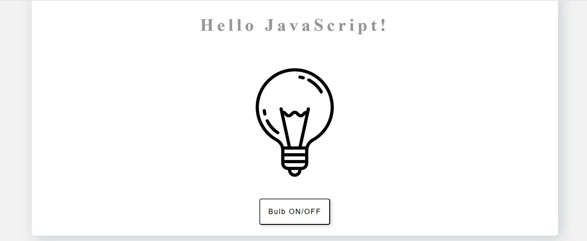
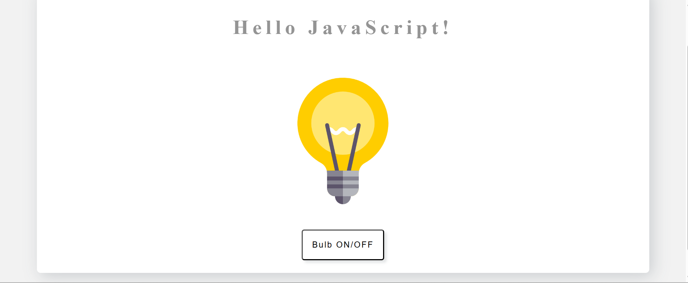

# 💡 Light Toggle Project (JavaScript)

A simple project that toggles light and dark modes using pure **HTML**, **CSS**, and **JavaScript**.

---

## 🖼️ Preview





---

## 🚀 Run Locally

```bash
git clone https://github.com/ysukkar2/light-javascript.git
cd light-javascript
open index.html
